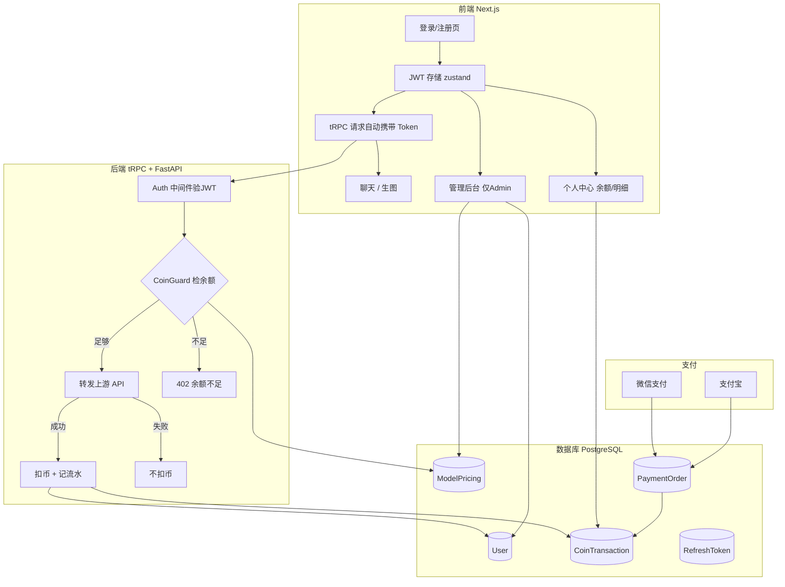

# 用户注册登录 + 金币计费系统 — 最终实施方案

## 一、确认的业务参数

| 参数 | 决策 |
|------|------|
| 数据库 | PostgreSQL（Prisma ORM） |
| 注册方式 | 邮箱+密码直接注册即可用，后续迭代加验证 |
| 新用户赠币 | 注册赠送 **1 金币** |
| 充值比例 | **1 元人民币 = 30 金币** |
| 支付方式 | 微信支付 + 支付宝（双渠道） |

### 模型定价表

| 模型 ID | 显示名称 | 类别 | 每次金币 |
|---------|----------|------|---------|
| `gemini-2.5-flash` | Gemini 2.5 Flash | 对话 | 1 |
| `gemini-2.5-pro` | Gemini 2.5 Pro | 对话 | 3 |
| `gemini-2.0-flash` | Gemini 2.0 Flash | 对话 | 1 |
| `imagen-3.0-generate-002` | Nano Banana Pro | 生图 | 12 |
| `gemini-2.0-flash-exp` | Nano Banana 2 | 生图 | 6 |

> [!NOTE]
> 以上模型 ID 为预定义值，管理后台可随时新增/修改/禁用模型与价格。

---

## 二、系统全景架构



---

## 三、数据库设计（Prisma Schema）

### 3.1 User 用户表
```prisma
model User {
  id           String   @id @default(uuid())
  email        String   @unique
  passwordHash String
  nickname     String
  avatar       String?
  role         UserRole @default(USER)
  coinBalance  Int      @default(1)  // 注册赠送1金币
  isActive     Boolean  @default(true)
  createdAt    DateTime @default(now())
  updatedAt    DateTime @updatedAt

  transactions  CoinTransaction[]
  refreshTokens RefreshToken[]
  paymentOrders PaymentOrder[]
}

enum UserRole {
  USER
  ADMIN
}
```

### 3.2 CoinTransaction 金币流水表
```prisma
model CoinTransaction {
  id          String          @id @default(uuid())
  userId      String
  user        User            @relation(fields: [userId], references: [id])
  type        TransactionType
  amount      Int             // 正=增加 负=扣除
  balance     Int             // 交易后余额快照
  modelId     String?         // 消耗时对应的模型
  description String
  createdAt   DateTime        @default(now())

  @@index([userId, createdAt])
}

enum TransactionType {
  RECHARGE   // 充值
  CONSUME    // 消费
  GIFT       // 赠送（注册赠送）
  REFUND     // 退款
}
```

### 3.3 ModelPricing 模型定价表
```prisma
model ModelPricing {
  id        String        @id @default(uuid())
  modelId   String        @unique
  modelName String
  category  ModelCategory
  coinCost  Int
  isActive  Boolean       @default(true)
  updatedAt DateTime      @updatedAt
}

enum ModelCategory {
  CHAT
  IMAGE
}
```

### 3.4 RefreshToken 刷新令牌表
```prisma
model RefreshToken {
  id        String   @id @default(uuid())
  userId    String
  user      User     @relation(fields: [userId], references: [id], onDelete: Cascade)
  token     String   @unique
  expiresAt DateTime
  createdAt DateTime @default(now())

  @@index([userId])
}
```

### 3.5 PaymentOrder 支付订单表
```prisma
model PaymentOrder {
  id            String       @id @default(uuid())
  userId        String
  user          User         @relation(fields: [userId], references: [id])
  orderNo       String       @unique  // 商户订单号
  channel       PayChannel            // 支付渠道
  amountYuan    Float                 // 支付金额（元）
  coinAmount    Int                   // 对应金币数
  status        OrderStatus  @default(PENDING)
  transactionId String?               // 第三方支付流水号
  paidAt        DateTime?
  createdAt     DateTime     @default(now())
  updatedAt     DateTime     @updatedAt

  @@index([userId, createdAt])
}

enum PayChannel {
  WECHAT
  ALIPAY
}

enum OrderStatus {
  PENDING
  PAID
  FAILED
  REFUNDED
}
```

---

## 四、API 设计

### 4.1 认证 API（tRPC Router: `auth`）
| 过程 | 输入 | 输出 |
|------|------|------|
| `register` | email, password, nickname | accessToken, refreshToken, user |
| `login` | email, password | accessToken, refreshToken, user |
| `refresh` | refreshToken | 新 accessToken |
| `logout` | refreshToken | success |
| `me` | (从 JWT 读) | user + coinBalance |

### 4.2 金币 API（tRPC Router: `coin`）
| 过程 | 说明 |
|------|------|
| `getBalance` | 查余额 |
| `getTransactions` | 分页查流水 |
| `checkBalance` | 预检查某模型余额是否足够 |

### 4.3 管理 API（tRPC Router: `admin`）
| 过程 | 说明 |
|------|------|
| `listUsers` | 分页查用户 |
| `rechargeUser` | 给用户充值 |
| `toggleUser` | 启用/禁用用户 |
| `listPricing` | 查模型定价 |
| `updatePricing` | 修改模型定价 |
| `getStats` | 统计概览 |

### 4.4 支付 API（Next.js API Route）
| 路径 | 说明 |
|------|------|
| `POST /api/pay/create` | 创建支付订单（返回二维码/跳转链接） |
| `POST /api/pay/notify/wechat` | 微信支付回调 |
| `POST /api/pay/notify/alipay` | 支付宝回调 |
| `GET /api/pay/status/:orderNo` | 前端轮询订单状态 |

### 4.5 AI 调用扣费中间件
```
请求 → authMiddleware(验JWT,注入userId) 
     → coinGuardMiddleware(查模型价格,检余额) 
     → 调用上游API 
     → 成功后: deductCoins(userId, modelId, cost) 
     → 返回结果
```

---

## 五、前端页面规划

| 页面/组件 | 路径/位置 | 说明 |
|-----------|----------|------|
| 登录注册页 | `/auth` | 邮箱+密码登录/注册表单 |
| 路由守卫 | 全局 `_app.tsx` | 未登录跳转 `/auth` |
| 用户信息栏 | 侧边栏底部 | 头像+昵称+金币余额 |
| 充值弹窗 | 组件 | 选择金额→扫码支付 |
| 消费明细 | `/profile` | 金币流水表格 |
| 管理后台 | `/admin` | 用户列表、充值、定价管理 |
| 余额不足弹窗 | 组件 | 调用前预检查不足时弹出 |

---

## 六、验证计划

### 自动化测试
- 注册→登录→获取Token→带Token调用AI→检查扣费→查余额
- 余额不足时拒绝调用返回402
- 管理员充值→用户余额增加
- 刷新Token续签

### 手动测试
- 手机端微信/支付宝扫码支付→充值到账
- 多用户并发调用时金币扣除的原子性
- 管理后台所有 CRUD 操作
